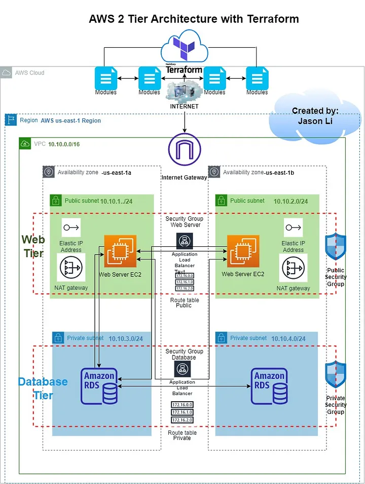

# awsprojet-mcit

## 📌 Project Overview
This project demonstrates the deployment of a **two-tier AWS architecture** to host a standard web application with a database, using **Terraform** for Infrastructure as Code (IaC) and **Terraform Cloud** for CI/CD automation.

graph from web site not my original:


---

## 🎯 Objectives
- Host a lightweight web application with a MySQL database  
- Use AWS best practices for security and scalability  
- Deploy infrastructure using Terraform for repeatability and automation  
- Hosting a blog using yumapache with amazonlinux2 as OS.
- Will be using a load balancer to direct traffic to the blog.
- Will be using RDS to make back up of the blog in case of problem with the EC2.
- Since its a blog we gonna use only TCP protocol to ensure reliable connection.
---

## 🏗 Architecture
The infrastructure includes:  
- **Custom VPC**
  - 2 Public Subnets for the **Web Server Tier**  
  - 2 Private Subnets for the **RDS Tier**  
- **Appropriate Route Tables** for internet and internal communication  
- **2 EC2 Instances** (Apache or NGINX) in the public subnets  
- **1 RDS MySQL Instance** (micro) in the private subnets  
- **Security Groups** for controlled access  
- **Application Load Balancer** for traffic distribution  
- Automated deployment via **Terraform Cloud**  

---

## 🔧 Design Decisions

1. **Region Selection**  
   AWS **us-east-1** was chosen for low latency to the client location.  

   - pricing
   Region:
   - US East (N. Virginia) the region choice mostly impact the pricing of the vpc service offered by aws.
2. **Internet gateway basics**

To use an internet gateway, you must attach it to a VPC and configure routing.

Routing configuration
If a subnet is associated with a route table that has a route to an internet gateway, it's known as a public subnet. If a subnet is associated with a route table that does not have a route to an internet gateway, it's known as a private subnet.

In your public subnet's route table, you can specify a route for the internet gateway to all destinations not explicitly known to the route table (0.0.0.0/0 for IPv4 

3. **VPC Isolation**  
   A dedicated VPC ensures network separation from other environments. 

   *Pricing*
- Nat gateway 0.045$/hour   = 32.4$/month 
- each ip address is 0.00027$/hour for ipam = for 5 ip address (2 ec2, 1 load balancer, 2 rds) 0.972$/month
- each public ipv4 is 0.005$/hour  = for 3 (2 ec2, 1load balancer) 10.8$/month
- You are charged $0.75 per VPC Route Server Endpoint per hour  = **still confused** 

4. **EC2 Configuration**  
   - Instance Type: `t2.micro` – suitable for a lightweight application  
   - Public subnets with internet access for serving content

   *Pricing*
t2.micro:
   - 0.0116$/hour for on demand each
   - since we getting 2 its gonna be around 16.8$per month
   - or if you reserve for 3 year it goes to 8.46$/month

5. **Load Balancer**  
   Distributes incoming traffic between the two web servers for high availability.  

   *Pricing*:
   - $0.0225 per Application Load Balancer-hour       = 16.2$/month                                     
   - $0.008 per LCU-hour 
   - $0.005 per hour per Trust Store Associated with Application Load Balancer when using Mutual TLS 
   - $0.008 per reserved LCU-hour

5.1  **LCU Details**
here some technical detail of how LCU are calculated:

An LCU measures the dimensions on which the Application Load Balancer processes your traffic (averaged over an hour). The four dimensions measured are:

   - New connections: Number of newly established connections per second. Typically, many requests are sent per connection. 
 CActive connections: Number of active connections per minute.
   - Processed bytes: The number of bytes processed by the load balancer in GBs for HTTP(S) requests and responses.
   - Rule evaluations: The product of the number of rules processed by your load balancer and the request rate. The first 10 processed rules are free (Rule evaluations = Request rate * (Number of rules processed - 10 free rules).
You are charged only on the dimension with the highest usage. An LCU contains:

   - 25 new connections per second.
   - 3,000 active connections per minute or 1,500 active connections per minute while using Mutual TLS.
   - 1 GB per hour for Amazon Elastic Compute Cloud (EC2) instances, containers, and IP addresses as targets, and 0.4 GB per hour for Lambda functions as targets. When using the Mutual TLS feature, data processed includes the bytes for the certificate metadata that the load balancer inserts into headers for every request that is routed to the targets.
   - 1,000 rule evaluations per second

6. **RDS Database**  
   - MySQL deployed in **private subnets** for security  
   - No internet access – accessible only by web server tier  

    *Pricing*
   - If you take saving plan for 1 or 3 years the monthly cost will be estimated at 1.90$ or 1.31$ the longer the plan the bigger the discount get.

7. **Security Groups**  
   - **Web Server SG:** Allow SSH (22) and HTTP (80)  
   - **RDS SG:** Allow MySQL (3306) only from the Web Server SG  
   - Production note: Use HTTPS (443) instead of HTTP for secure communication  

    *Pricing*
   - for both the security group and key pair there should be no cost associate to it.

8. **Monitoring**

- Here some monitoring tool to use to minimise down time and identify upcomming problem before they escalade too far

- Amazon CloudWatch for EC2: 
Collect metrics from Amazon EC2 instances (CPU utilization, network I/O, disk I/O), Application Load Balancers (request count, latency, healthy host count), and Auto Scaling Groups (instance health, scaling activities

- Amazon CloudWatch for data base (RDS):
Monitor key metrics for Amazon RDS instances like CPU utilization, database connections, free storage space, read/write IOPS, and network throughput.

- Amazon CloudWatch for load balancer:
 Monitor Network Load Balancer (NLB) metrics, such as active flow count and processed bytes
This will be what ill monitor using cloudwatch:
- 5XX errors (alb_5xx)
- High latency (alb_latency)
- Request count spikes (alb_request_count)

- Amazon GuardDuty: Continuously monitor for malicious activity and unauthorized behavior.

- Amazon SNS: Send notifications to email, SMS, or other endpoints for critical events.

- Amazon OpenSearch Service (formerly Elasticsearch Service):
Store and analyze logs from various sources for centralized monitoring and troubleshooting.

9. **Terraform Advantages**  
   - Easy scaling and updates  
   - Reusable code for similar future projects  

---

## 📋 Prerequisites 
- An **AWS account** with appropriate IAM permissions  
- **Terraform CLI**   
- AWS CLI configured locally:  
  ```bash
  aws configure

##  Pricing (Monthly Estimate with 3-Year Reserved Plans)

| Resource                | Quantity | Unit Price          | Est. Monthly Cost |
|--------------------------|----------|---------------------|-------------------|
| NAT Gateway             | 1        | $0.045/hr           | $32.40            |
| IPAM Addresses          | 5        | $0.00027/hr         | $0.97             |
| Public IPv4             | 3        | $0.005/hr           | $10.80            |
| EC2 (t2.micro)          | 2        | $8.46 (reserved)    | $16.92            |
| RDS MySQL (db.t3.micro) | 1        | $1.31–$1.90 (reserved) | $1.90          |
| Load Balancer (ALB)     | 1        | $0.0225/hr          | $16.20            |
| Security Groups / Key Pairs | -    | Free                | $0                |
| CloudWatch Basic        | -        | Free tier           | $0                |
| **Total Estimate**      |          |                     | **≈ $70.14/month** |

- in total would be estimated at 70.142/month *(excluding load blancer LCU and VPC route server endpoint)*