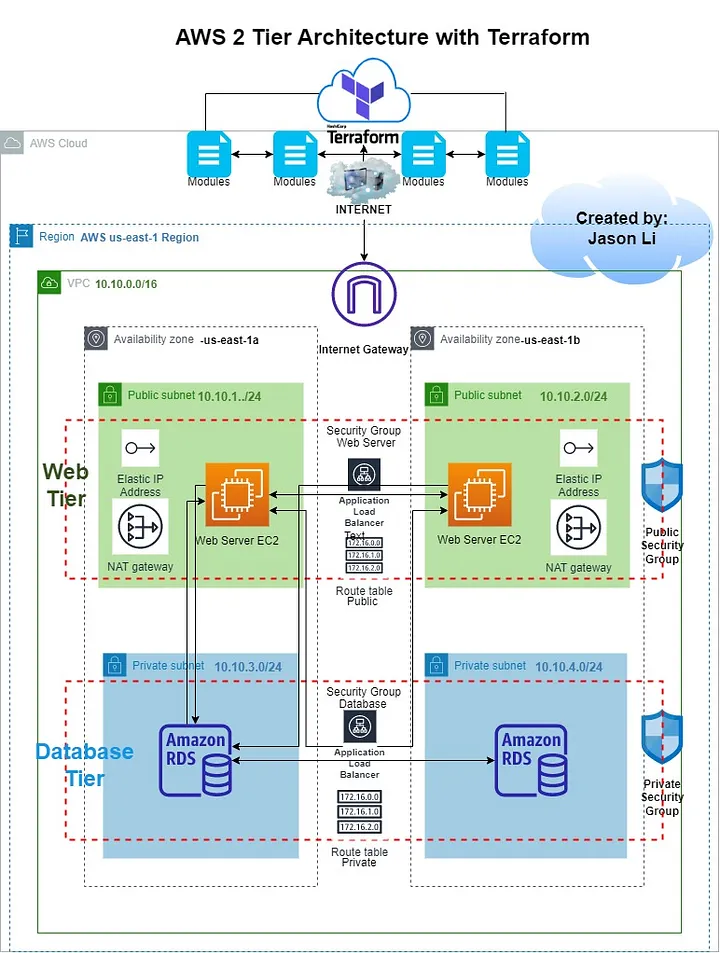

# awsprojet-mcit

## 📌 Project Overview
This project demonstrates the deployment of a **two-tier AWS architecture** to host a standard web application with a database, using **Terraform** for Infrastructure as Code (IaC) and **Terraform Cloud** for CI/CD automation.

graph from web site not my original:


---

## 🎯 Objectives
- Host a lightweight web application with a MySQL database  
- Use AWS best practices for security and scalability  
- Deploy infrastructure using Terraform for repeatability and automation  

---

## 🏗 Architecture
The infrastructure includes:  
- **Custom VPC**
  - 2 Public Subnets for the **Web Server Tier**  
  - 2 Private Subnets for the **RDS Tier**  
- **Appropriate Route Tables** for internet and internal communication  
- **2 EC2 Instances** (Apache or NGINX) in the public subnets  
- **1 RDS MySQL Instance** (micro) in the private subnets  
- **Security Groups** for controlled access  
- **Application Load Balancer** for traffic distribution  
- Automated deployment via **Terraform Cloud**  

---

## 🔧 Design Decisions

1. **Region Selection**  
   AWS **us-east-1** was chosen for low latency to the client location.  

2. **VPC Isolation**  
   A dedicated VPC ensures network separation from other environments.  

3. **EC2 Configuration**  
   - Instance Type: `t2.micro` – suitable for a lightweight application  
   - Public subnets with internet access for serving content  
   heres the pricing for the ec2 we are going to use:
   
t2.micro:

   - 0.0116$/hour for on demand
   - since we getting 2 its gonna be around 16.8$per month
   - if you reserve for 3 year it goes to 4.23$/month

4. **Load Balancer**  
   Distributes incoming traffic between the two web servers for high availability.  
   heres a list of pricing for the region we gonna deploy:
   - $0.0225 per Application Load Balancer-hour 
   - $0.008 per LCU-hour 
   - $0.005 per hour per Trust Store Associated with Application Load Balancer when using Mutual TLS 
   - $0.008 per reserved LCU-hour

4.1  **LCU Details**
here some technical detail of how LCU are calculated:

An LCU measures the dimensions on which the Application Load Balancer processes your traffic (averaged over an hour). The four dimensions measured are:

   - New connections: Number of newly established connections per second. Typically, many requests are sent per connection. 
 CActive connections: Number of active connections per minute.
   - Processed bytes: The number of bytes processed by the load balancer in GBs for HTTP(S) requests and responses.
   - Rule evaluations: The product of the number of rules processed by your load balancer and the request rate. The first 10 processed rules are free (Rule evaluations = Request rate * (Number of rules processed - 10 free rules).
You are charged only on the dimension with the highest usage. An LCU contains:

   - 25 new connections per second.
   - 3,000 active connections per minute or 1,500 active connections per minute while using Mutual TLS.
   - 1 GB per hour for Amazon Elastic Compute Cloud (EC2) instances, containers, and IP addresses as targets, and 0.4 GB per hour for Lambda functions as targets. When using the Mutual TLS feature, data processed includes the bytes for the certificate metadata that the load balancer inserts into headers for every request that is routed to the targets.
   - 1,000 rule evaluations per second

4.2   **load balancer code**
```hcl
# Create a Load Balancer
resource "aws_lb" "myalb" {
  name               = "2TierApplicationLoadBalancer"
  internal           = false
  load_balancer_type = "application"
  subnets            = [aws_subnet.public1.id, aws_subnet.public2.id]
  security_groups    = [aws_security_group.albsg.id]
}

# Security Group for ALB
resource "aws_security_group" "albsg" {
  name        = "albsg"
  description = "security group for alb"
  vpc_id      = aws_vpc.main.id

  ingress {
    from_port   = 0
    to_port     = 0
    protocol    = "-1"
    cidr_blocks = ["0.0.0.0/0"]
  }

  egress {
    from_port   = 0
    to_port     = 0
    protocol    = "-1"
    cidr_blocks = ["0.0.0.0/0"]
  }
}
```
5. **RDS Database**  
   - MySQL deployed in **private subnets** for security  
   - No internet access – accessible only by web server tier  

6. **Security Groups**  
   - **Web Server SG:** Allow SSH (22) and HTTP (80)  
   - **RDS SG:** Allow MySQL (3306) only from the Web Server SG  
   - Production note: Use HTTPS (443) instead of HTTP for secure communication  

7. **Terraform Advantages**  
   - Easy scaling and updates  
   - Reusable code for similar future projects  

---

## 📋 Prerequisites 
- An **AWS account** with appropriate IAM permissions  
- **Terraform CLI**   
- AWS CLI configured locally:  
  ```bash
  aws configure
